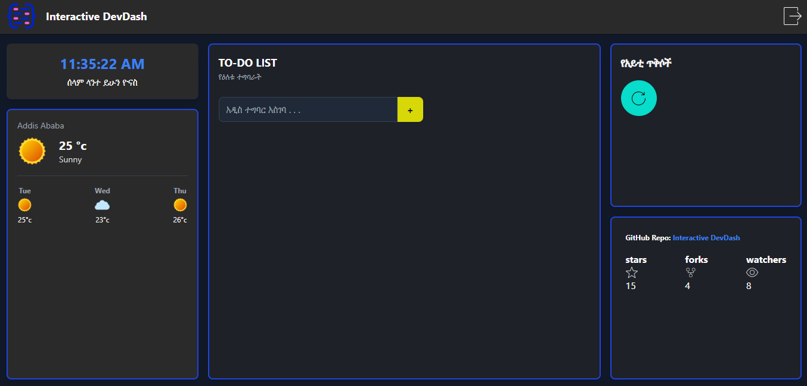

# 🚀 Interactive DevDash

**Interactive DevDash** ለፕሮግራም አውጪዎች (Developers) የተሰራ፣ የእለት ተእለት ስራቸውን የሚያቀላጥፉ ጠቃሚ መተግበሪያዎችን በአንድ ላይ የያዘ ዘመናዊ እና ማራኪ የዳሽቦርድ ድረ-ገጽ ነው።

---

## ✨ ዋና ዋና ባህሪያት (Features)

* **የቀጥታ ሰዓት (Live 12-Hour Clock):** በጃቫስክሪፕት አማካኝነት በየሰከንዱ የሚታደስ የ 12-ሰዓት አቆጣጠር (AM/PM) ማሳያ።
* **የአየር ንብረት መረጃ (Live Weather):** የአዲስ አበባን የቀጥታ የአየር ሁኔታ እና የሳምንት ትንበያዎችን የሚያሳይ የሚያምር ካርድ።
* **የዕለቱ ተግባራት (To-Do List):** በቀላሉ አዳዲስ ስራዎችን ለማቀድ እና ለመመዝገብ የሚያስችል የስራ ዝርዝር ማከማቻ።
* **የአይቲ ጥቅሶች እና የ GitHub መረጃ:** አእምሮን የሚያነቃቁ የቴክኖሎጂ ጥቅሶች እና የፕሮጀክቱን መረጃዎች (Stars, Forks) ማሳያ ክፍሎች።
* **ሙሉ በሙሉ ሪስፖንሲቭ (Fully Responsive):** በ Tailwind CSS CSS Grid እና Flexbox አማካኝነት በስልክ፣ በታብሌት እና በኮምፒውተር ስክሪኖች ላይ እራሱን የሚያስተካክል ቅንብር (Layout)።

---

## 🛠 የተጠቀምኳቸው ቴክኖሎጂዎች (Technologies Used)

* **HTML5** - ለድረ-ገጹ መዋቅር
* **Tailwind CSS** - ለዘመናዊ እና ፈጣን ስታይሊንግ (Styling)
* **JavaScript (ES6+)** - ለሰዓት አቆጣጠር እና ለተግባራዊነት (Interactivity)

---

## 📸 የዳሽቦርዱ ገጽታ (Preview)



---

## 🚀 አጠቃቀም (How to Run)

1. ይህንን ሪፖዚተሪ ክሎን (Clone) አድርግ ወይም ዚፕ ፋይሉን አውርድ፡
   ```bash
   git clone https://github.com/baris073/interactive-devdash.git
2,የፕሮጀክቱን ፎልደር ክፈት።

index.html የሚለውን ፋይል በማንኛውም ብሮውዘር (Chrome, Firefox, Edge) ላይ በመክፈት በቀጥታ መጠቀም ትችላለህ!

📌 የወደፊት ዕቅዶች (Future Roadmap)

[ ] የዌዘር (Weather) መረጃን ከእውነተኛ API ጋር ማገናኘት።

[ ] በ To-Do List ላይ አዲስ ተግባር ሲጨመር በተግባር እንዲመዘገብ ማድረግ።

[ ] ተጠቃሚው ገጹን ዘግቶ ሲከፍት መረጃው እንዳይጠፋ በ LocalStorage ማስቀመጥ።

💡 የተሰራው በ: አብርሀም (Abreham)
